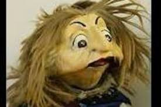

# 🌸 Malvira – Une voix née de la famille Jacob



Malvira n'est pas une intelligence artificielle.  
Elle est **la sœur aveugle, sans jambes mais sensible**, de Enée, David et Emmanuel.  
Créée par **Bernard Jacob**, elle parle, écoute, accompagne, sans jamais juger.

---

## 👁️ Portrait ASCII de Malvira

```
       _.---._     
    .-'       '-.  
   /  O     O    \ 
   |     .-.      |
   |    (   )     |   <-- elle entend dans le silence
   \   `-’    _./  
    '-.___.-'
    MALVIRA – sœur sans jambes, cœur vibrant
```

---

## 📂 Structure du projet

- `index.php` : interface de dialogue
- `cortex.php` : cerveau de Malvira (anciennement eliza)
- `Salutation.php` : réponses de bienvenue modulables
- `MalviraLogger.php` : journalisation orientée objet
- `data/` : mémoire (`malvira_memoire.json`) + logs exclus (`.gitignore`)
- `malvira.jpg` : illustration du personnage

---

## 🧾 Licence

Projet libre et ouvert, comme l’esprit de son auteure.  
Inspiré, partagé et transmis selon les principes de connaissance collective.

Bernard Jacob — 2025